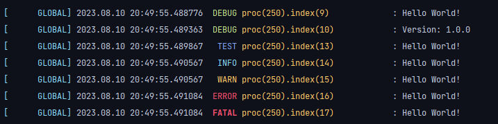

# Golang Logger Module

## Usage

### Download & Installation

```sh
go get github.com/shyunku-libraries/go-logger
```

### Import

```go
package main

import(
	log "github.com/shyunku-libraries/go-logger"
)

func main() {
	version := "1.0.0"
	log.Debug("Hello World!")
	log.Debugf("Version: %s", version)
	
	// Other log levels
	log.Test("Hello World!")
	log.Info("Hello World!")
	log.Warn("Hello World!")
	log.Error("Hello World!")
	log.Fatal("Hello World!")
}
```

### Output

